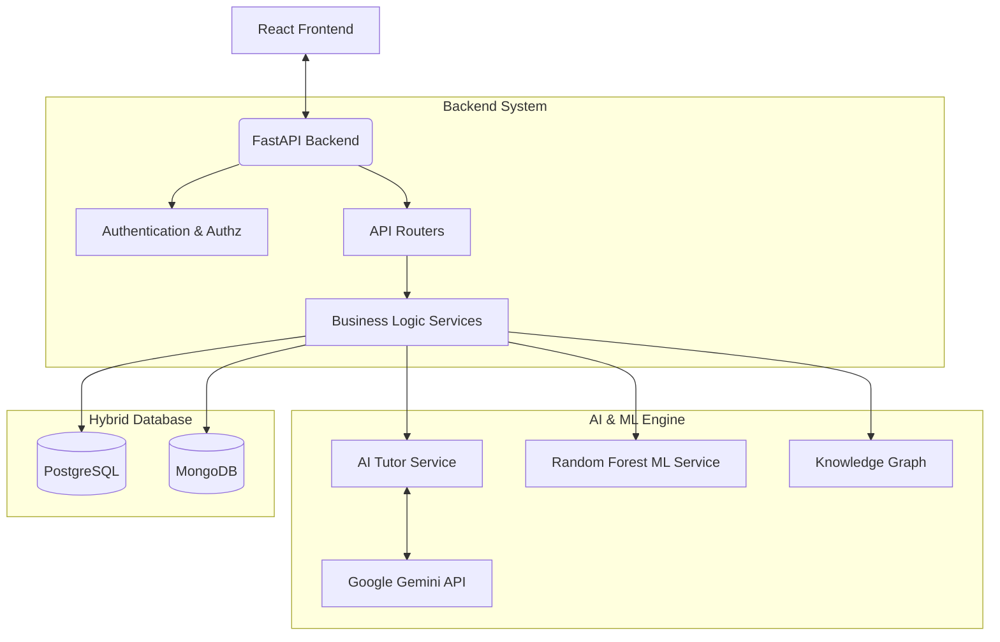
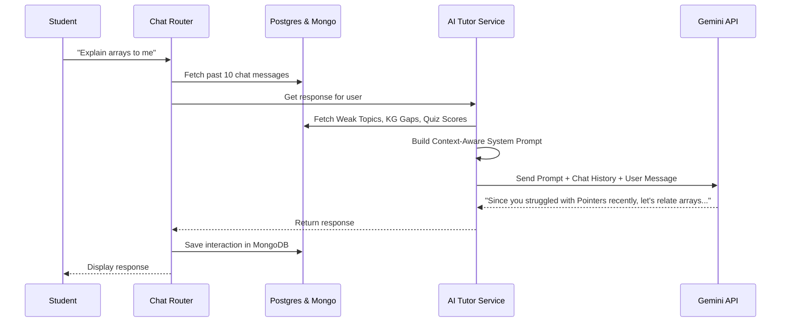

# AI Learn Platform - Full Backend Architecture Guide

This document provides a detailed, step-by-step explanation of the backend for the **AI Learn Platform**. It covers the architecture, the database design, the logic flows, and the role of every key file in the system.

---

## 1. High-Level Architecture Diagram
The backend is built with **FastAPI** (Python 3.12) and acts as the brain of the platform. It communicates with a React frontend, Machine Learning models (Scikit-Learn), Generative AI models (Google Gemini 2.5 Flash), and two different databases.



### Why a Hybrid Database?
- **PostgreSQL**: Used for highly structured, relational data where consistency is critical (e.g., Users, Quizzes, Performance stats, Content).
- **MongoDB**: Used for high-volume, unstructured, document-based data (e.g., AI Chat History, Activity Logs). Storing large chat blobs in Postgres would degrade performance, so MongoDB handles it effortlessly.

---

## 2. Directory Structure & File Breakdown

The backend code is organized into logical directories inside the `backend/` folder:

```text
backend/
├── main.py                 # The entry point of the FastAPI application
├── config.py               # Application configuration and environment variables
├── routers/                # API Endpoints (Controllers)
├── services/               # Core Business Logic (AI, ML, Auth)
├── utils/                  # Helper functions (Response formatting, etc.)
└── scripts/                # Utility scripts (e.g., seeding the database)

database/
├── connection.py           # DB connection logic for Postgres and MongoDB
└── models/                 
    ├── postgres_models.py  # SQLAlchemy models for relational tables
    └── mongodb_schemas.py  # Pydantic schemas for MongoDB documents
```

### 2.1 `backend/main.py`
This is the root of the application. It:
1. **Initializes FastAPI**: Sets up the app instance (`app = FastAPI(...)`).
2. **Lifecycle Management**: Uses `@asynccontextmanager` to connect to PostgreSQL and MongoDB on startup, and close them on shutdown.
3. **CORS Middleware**: Allows the React frontend (running on ports 3000, 5173, etc.) to securely talk to the API.
4. **Mounts Routers**: Attaches all the individual route files (Auth, Users, Learning, Chat, etc.) to the main application via `app.include_router()`.

### 2.2 `backend/config.py`
Uses `pydantic_settings` to load environment variables from the `.env` file. It manages database URLs, JWT secret keys, and API keys for OpenAI/Gemini securely.

---

## 3. Database Models (`database/models/`)

### PostgreSQL Models (`postgres_models.py`)
Uses **SQLAlchemy ORM** to define tables. Key tables include:
- **`User` & `UserProfile`**: Stores login credentials, roles, selected courses, and streaks.
- **`Subject` & `Topic` & `Content`**: Defines the hierarchy of learning materials. A Subject has many Topics, and a Topic has many Contents (Videos, Articles).
- **`QuizAttempt` & `QuestionBank`**: Stores pre-defined questions and logs when a student attempts a quiz (including their accuracy and time taken).
- **`TopicPerformance` & `PerformanceRecord`**: Stores the student's mastery level ("Weak", "Moderate", "Strong") for a specific topic, calculated by the ML model.

### MongoDB Schemas (`mongodb_schemas.py`)
Uses **Pydantic** to define document structures. Key collections include:
- **`ChatHistory`**: Stores every interaction between the student and the AI Tutor (`user_message`, `ai_response`, `timestamp`).
- **`ActivityLog`**: Tracks raw events like "watched_video" or "completed_quiz" for analytics.

---

## 4. Core Services & Logic (`backend/services/`)

This directory contains the "brains" of the application. 

### 4.1 Machine Learning Service (`ml_service.py`)
Responsible for assessing how well a student understands a topic.
- **Model**: `RandomForestClassifier` from Scikit-Learn.
- **Logic**: It looks at 4 features: `accuracy`, `avg_time_seconds`, `total_attempts`, and `difficulty_weight`.
- **Output**: Predicts whether a student's mastery is `"Weak"`, `"Moderate"`, or `"Strong"`. This label is stored in the PostgreSQL database and informs the AI Tutor.

### 4.2 AI Tutor Service (`ai_tutor.py`)
This is the most crucial file for the Generative AI integration. It acts as the orchestrator for the Gemini AI.

**The Context-Aware Prompt Logic:**
Instead of just sending a user's question to the AI, `ai_tutor.py` builds a massive "System Prompt" loaded with context:
1. **Weak Topics**: Fetches the student's "Weak" topics from PostgreSQL.
2. **Knowledge Graph Gaps**: Checks the `knowledge_graph` to see if they are missing foundational prerequisites.
3. **Recent Quizzes**: Retrieves the score of their most recent quiz.
4. **Current Recommendations**: Retrieves articles/videos the system currently recommends.

It combines all this into a hidden prompt that tells Gemini exactly how to treat the student. 

#### Flow Diagram: AI Doubt Solving


---

## 5. API Routers (`backend/routers/`)

Routers map URL endpoints (like `/api/chat/message`) to the python functions that execute the logic.

### 5.1 Chat Router (`chat.py`)
Handles everything related to the AI assistant.
- **`POST /message`**: The main chat endpoint. It fetches the last 10 messages from MongoDB, calls the `ai_tutor_service` to get an answer, saves the new message to MongoDB, and returns the response.
- **`POST /generate-quiz`**: The **Hybrid Quiz Engine**. 
  - **Step 1**: It checks the PostgreSQL `QuestionBank` table for existing questions on a topic.
  - **Step 2**: If there aren't enough questions, or if dynamic questions are requested, it uses the AI Tutor to generate a brand new quiz on the fly. It enforces strict rules (e.g., "Output strictly as a JSON array") so the React frontend can render it beautifully.

### 5.2 Auth Router (`auth.py`)
Handles user registration, login, and JWT (JSON Web Token) creation. When a user logs in, this router verifies the password hash and returns a token that the frontend must send with future requests to prove identity.

### 5.3 Other Routers
- **`analytics.py` & `dashboard.py`**: Queries PostgreSQL to aggregate data (total study time, quizzes passed, weak topics) and sends it to the frontend dashboard charts.
- **`streak.py`**: Manages the gamification aspect (calculating how many consecutive days a user has studied).

---

## 6. Summary of the Data Flow

Let's trace a student taking a quiz and getting feedback:
1. **Request**: Student clicks "Take Quiz" on Frontend.
2. **Generate**: `chat.py` tries to fetch questions from Postgres. If empty, asks Gemini to generate a JSON quiz.
3. **Attempt**: Student submits answers.
4. **Evaluate (ML)**: `ml_service.py` takes the score, time taken, and difficulty, and the Random Forest model updates the student's status (e.g., from "Weak" to "Moderate").
5. **Persist**: The new status is saved in PostgreSQL (`TopicPerformance`).
6. **Next Chat**: The next time the student talks to the AI, `ai_tutor.py` reads the new "Moderate" status, and Gemini adjusts its tone and difficulty accordingly.

This creates a continuous, automated feedback loop that constantly adapts to the student's actual competence level.
